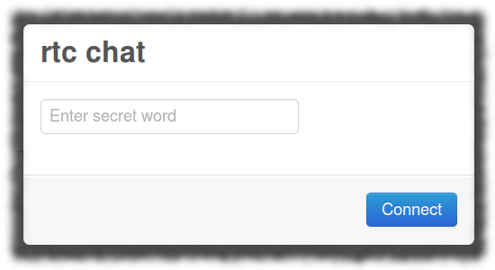

rtc chat
========

WebRTC peer-to-peer chat service written in Go

Q: What does it take to connect two browsers, both behind NAT?  
A: A secret word.

 

Works with [Firefox 22+](http://getfirefox.com/) on the Desktop and with [Firefox 25+ on Android](http://ftp.mozilla.org/pub/mozilla.org/mobile/nightly/latest-mozilla-central-android/).

Try out live rtcchat: [http://timur.mobi/rtcchat](http://timur.mobi/rtcchat/)

(Please note: my site is using a self-signed certificate.)

Features
--------

rtcchat...

- helps two browsers establish a direct data link
- p2p communication works over encrypted, reliable UDP
- comes with it's own STUN and signaling services
- no 3rd-party servers will be contacted

Run precompiled executable
--------------------------

No specific runtimes need to be installed. The precompiled executables are 100% selfcontained.

	mkdir rtcchat
	cd rtcchat

Download: 

1. one of the precompiled executable binaries for your platform from: 
[http://github.com/mehrvarz/files](http://github.com/mehrvarz/files)
(click 'Raw')

2. the platform neutral web application archive:
[https://github.com/mehrvarz/files/raw/master/rtcchat-webroot.zip](https://github.com/mehrvarz/files/raw/master/rtcchat-webroot.zip)

Unzip both archives into your new "rtcchat" folder.

Create keys for WebSocket signaling over https (see below).
Or run your executable with option: -secure=false

This is how your rtcchat folder should look:

	rtcchat
		webroot
			index.html
			rtcchat.js
			adapter.js
			bootstrap.min.css
			...
		keys
			key.pem
			cert.pem
		rtcchat-darwin-amd64

Now you can run the executable:

	./rtcchat{-os-platform} [-options]

Run from source
---------------

Golang 1.1 needs to be installed.

	go get github.com/mehrvarz/rtcchat
	cd $GOPATH/src/github.com/mehrvarz/rtcchat

Create keys for WebSocket signaling over https (see below) or add option: -secure=false

Now you can run the main package:

	go run rtcchat/main.go [-options]

Server command line options
---------------------------

This tables shows command line options with their default values:

	-hostaddr="": set host ip address
	-sigport=8077: set signaling port
	-stunport=19253: set STUNs port
	-secure=true: set to false to allow signaling over http instead of https
	-webroot="webroot": set path to webroot

Create keys for WebSocket signaling over https
----------------------------------------------

	mkdir keys && cd keys
	openssl req -new -x509 -nodes -out cert.pem -keyout key.pem -days 100
	(answer questions)
	cd ..

Alternative: link to your existing keys froms /etc/nginx

	mkdir keys && cd keys
	ln -s /etc/nginx/cert.pem cert.pem
	ln -s /etc/nginx/key.pem key.pem
	cd ..

Please note: the "keys" subfolder is expected to contain two files: "cert.pem" and "key.pem".

Establish p2p connection
------------------------

Open two instances of Firefox and browse to: 

	https://{hostaddr}:8077/rtcchat

License
-------

This project uses code from:

bootstrap.js: Copyright 2012 Twitter, Inc; Apache License, Version 2.0. 
jquery: Copyright jQuery Foundation and contributors; MIT License. 
adapter.js: Copyright 2013 Chris Ball <chris@printf.net>. 

For the rest:

Copyright (C) 2013 Timur Mehrvarz

Permission is hereby granted, free of charge, to any person obtaining a
copy of serverless-webrtc and associated documentation files (the "Software"),
to deal in the Software without restriction, including without limitation the
rights to use, copy, modify, merge, publish, distribute, sublicense, and/or
sell copies of the Software, and to permit persons to whom the Software is
furnished to do so, subject to the following conditions:

The above copyright notice and this permission notice shall be included in
all copies or substantial portions of the Software.

THE SOFTWARE IS PROVIDED “AS IS”, WITHOUT WARRANTY OF ANY KIND, EXPRESS OR
IMPLIED, INCLUDING BUT NOT LIMITED TO THE WARRANTIES OF MERCHANTABILITY,
FITNESS FOR A PARTICULAR PURPOSE AND NONINFRINGEMENT. IN NO EVENT SHALL THE
AUTHORS OR COPYRIGHT HOLDERS BE LIABLE FOR ANY CLAIM, DAMAGES OR OTHER
LIABILITY, WHETHER IN AN ACTION OF CONTRACT, TORT OR OTHERWISE, ARISING FROM,
OUT OF OR IN CONNECTION WITH THE SOFTWARE OR THE USE OR OTHER DEALINGS IN
THE SOFTWARE.

